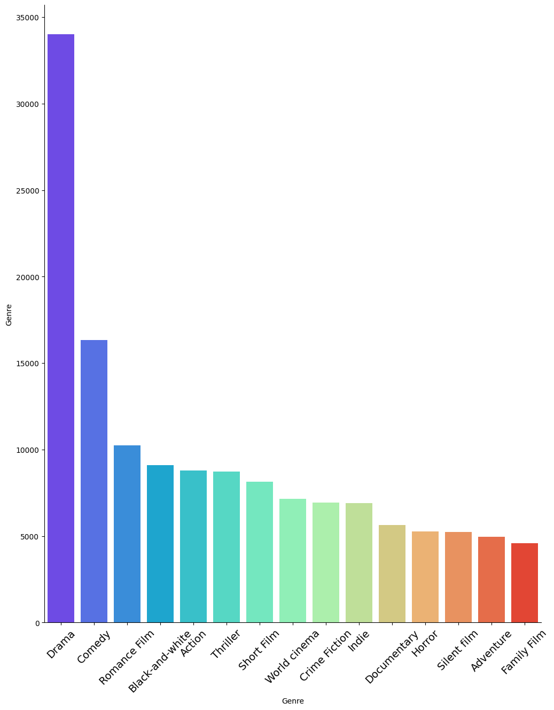
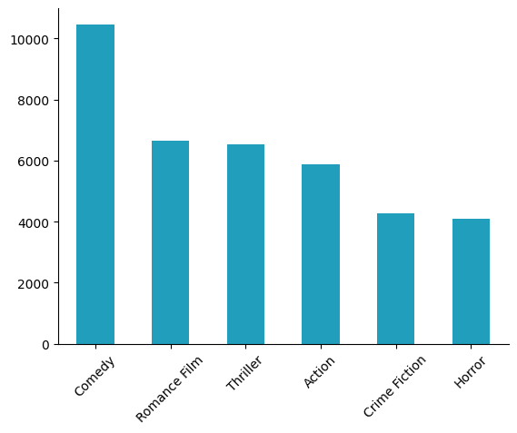

# Movie Genre Classification

### Introduction

Movie genre classification plays a crucial role in content recommendation systems by providing personalized movie suggestions, boosting user engagement. This significantly improves search functionality, allowing for efficient genre-based filtering and accurate search results. 

In this project, A genre classifier is developed that identifies the various genres a movie falls under given the plot summary. 
This provides valuable insights into audience preferences and market trends. This information is crucial for content producers and marketers to understand genre popularity to make decisions about future content creation and marketing strategies.

This classification also facilitates content analysis and insights, enabling trend analysis and guiding market research for informed content production and marketing decisions. Additionally, it supports content creation by helping creators align with genre norms and audience expectations, while also aiding in the curation of thematic or genre-specific collections to improve user experience.

### Dataset

- 42,306 movie plot summaries extracted from IMDB and Wikipedia, with 362 different genres. 
- **Note:** Multi-label classification of movies by genre is challenging due to several reasons that might be contributing to the low performance. Some of these challenges include:
- Movie genres often have complex relationships and overlaps, making it difficult for models to distinguish between them based solely on features. We visualized the correlation between various genres, maintaining the genres with reasonable amount of overlapping with other labels to improve the performance.
- The imbalance in movies dataset can cause the model to be biased towards the more frequent genres. We remove few-shot labels at the first step, and perform statistical sampling from the original dataset to prevent biased results from trained model.

  
  
  

### Methodology

- In preprocessing step, we performed tokenization to convert text into tokens (words, sub-words, or characters) that the model can understand. Next steps included removing unnecessary characters, punctuation, or special symbols, normalization and lower casing, stemming and lemmatization.
- Next, we performed vectorization to encode text data into numerical format to capture the contextual features of the plot summaries and make them suitable for machine learning models. We utilized TF-IDF with ngram size (1,3) to capture more relationships between words.
- Finally, we trained our own language model as well as distinct classifiers and compared their results. Our language model is a Deep Learning (DL) model with multiple dense layers, batch normalization, regularization, and dropout for multi-label classification. It uses an Adam optimizer, step decay learning rate schedule, and early stopping for training the model.

  
   
  

 
### Results

- The metrics used to evaluate the deep learning (DL) classifier are mean average precision, F1 score and Jaccard score. The DL model achieved the highest scores indicating superior performance in predicting movie genres.

- The below confusion matrix for our DL model indicates that most of the predictions made are correct and it gives an intuition of how the classifier understands the plot summaries and which genres does it confuse with for each genre.

### Conclusion

- The deep learning (DL) model, specifically designed for multilabel classification, consistently demonstrated superior performance compared to traditional machine learning algorithms such as Support Vector Machines (SVM), Logistic Regression (LR), and LightGBM (LGM). The model's predictions for that genre are mostly correct, minimizing the number of false positives and only misses some true instances of a particular genre. The model's validation performance is close to the training performance indicating good generalization capability.
- The confusion matrix helps us visualize the model's working. From the confusion matrix, it is seen that the model mostly confuses between romance-comedy and thriller-crime, leading to the slight decrease in performance. This can be addressed through various feature extraction and contextual understanding strategies. Various other techniques could be explored in the future to overcome the correlation and similarity problems in movie genre classification.
- This model can be extended to identify more genres and use various other meta data to improve its robustness. Future work includes experimenting with different feature set and hyper-parameter tuning to optimize the model performance. More advanced models could be explored to understand the sequence and context of texts. Additionally, investigating interpretability methods for DL models could provide insights into how genre predictions are made, thereby increasing trust and usability.

